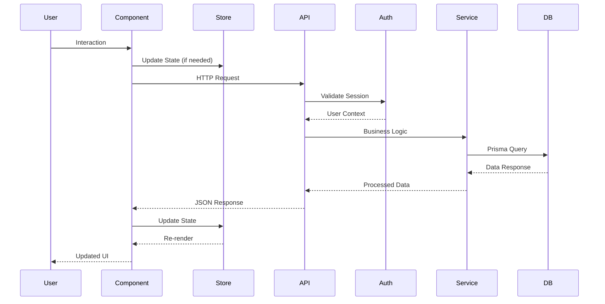
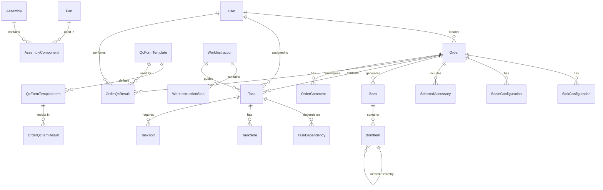

# Architecture Overview

> **Project Type**: Medical Device Production Workflow Web Application  
> **Tech Stack**: Next.js 15 + Node.js + PostgreSQL + Prisma  
> **Industry**: Medical Device Manufacturing (CleanStation Reprocessing Sinks)

## System Architecture Diagram

```mermaid
graph TB
    subgraph "Client Layer (Port 3005)"
        UI[Next.js Frontend]
        UI --> |ShadCN Components| Components[React Components]
        UI --> |State Management| Zustand[Zustand + Immer Stores]
        UI --> |Authentication| NextAuth[NextAuth.js Session]
    end

    subgraph "API Layer"
        UI --> |HTTP Requests| NextAPI[Next.js API Routes]
        NextAPI --> |Auth Middleware| Auth[getAuthUser()]
        NextAPI --> |Business Logic| BizLogic[TypeScript Services]
        
        subgraph "Legacy (Deprecated)"
            LegacyAPI[Node.js Server :3001]
            LegacyAPI -.-> |Being Phased Out| DB
        end
    end

    subgraph "Data Layer"
        BizLogic --> |Prisma ORM| DB[(PostgreSQL)]
        DB --> |9 Migrations| Schema[Complex Schema<br/>961 lines, 35+ models]
    end

    subgraph "External Systems"
        NextAPI --> |File Storage| FileSystem[Local File System]
        NextAPI --> |Notifications| Email[Email Service]
        UI --> |Document Preview| PDFViewer[PDF/Image Viewer]
    end

    subgraph "Development Tools"
        DB --> |Testing| Jest[Jest + Playwright]
        UI --> |Testing| RTL[React Testing Library]
        Schema --> |Seeding| Seeds[Comprehensive Seed Scripts]
    end

    classDef primary fill:#e1f5fe
    classDef legacy fill:#ffebee,stroke-dasharray: 5 5
    classDef data fill:#f3e5f5
    classDef external fill:#fff3e0

    class UI,NextAPI,BizLogic primary
    class LegacyAPI legacy
    class DB,Schema data
    class FileSystem,Email,PDFViewer external
```

## Application Layers

### 1. Frontend Layer (Next.js 15)
- **Framework**: Next.js 15 with App Router architecture
- **UI Library**: ShadCN UI components built on Radix primitives
- **Styling**: Tailwind CSS with custom design system
- **State Management**: Zustand with Immer for complex state (order creation)
- **Authentication**: NextAuth.js session-based authentication
- **Forms**: React Hook Form with Zod validation

### 2. API Layer (Hybrid Architecture)

#### Primary: Next.js API Routes (Port 3005)
- **Complete TypeScript implementation** with native business logic
- **Authentication integration** using NextAuth.js sessions
- **Role-based access control** with 6 user roles
- **Standardized error handling** and response formats
- **Rate limiting** via middleware (differentiated by endpoint type)

#### Legacy: Node.js Server (Port 3001) - DEPRECATED
- **Status**: Can be removed - all functionality migrated to Next.js
- **Preserved**: For reference and migration verification only
- **Original purpose**: BOM generation and legacy API compatibility

### 3. Data Layer
- **Database**: PostgreSQL with comprehensive schema
- **ORM**: Prisma with type-safe database access
- **Migrations**: 9 migrations tracking system evolution
- **Seeding**: Comprehensive scripts (284 parts, 334 assemblies, 154 pegboard kits)

## Data Flow Architecture



## Database Relationships



## Technology Choices and Reasoning

### Frontend Architecture Decisions

**Next.js 15 with App Router**
- ✅ **Server-side rendering** for better SEO and performance
- ✅ **File-based routing** for intuitive URL structure
- ✅ **API routes** for backend integration without separate server
- ✅ **TypeScript support** for type safety across full stack

**ShadCN UI Component System**
- ✅ **Accessibility-first** with Radix primitives
- ✅ **Customizable** design system with Tailwind integration
- ✅ **Copy-paste architecture** for maintainability
- ✅ **Consistent patterns** across entire application

### Backend Architecture Decisions

**Hybrid → Native Next.js Migration**
- ✅ **Eliminated dependency** on separate Node.js server
- ✅ **Complete TypeScript migration** for type safety
- ✅ **Integrated authentication** with NextAuth.js
- ✅ **Simplified deployment** to single application

**Prisma ORM Selection**
- ✅ **Type-safe database access** with generated types
- ✅ **Migration system** for schema versioning
- ✅ **Introspection** for existing database compatibility
- ✅ **Query optimization** with relation loading

### Authentication Strategy

**NextAuth.js with Credentials Provider**
- ✅ **Session-based authentication** for security
- ✅ **Role-based access control** integration
- ✅ **Server-side authentication** utilities
- ✅ **Flexible provider system** for future OAuth integration

## Scalability Considerations

### Performance Optimizations
- **Bundle optimization** with optimized package imports
- **Image optimization** with Next.js built-in features
- **Code splitting** with dynamic imports where appropriate
- **Database indexing** on frequently queried fields

### Horizontal Scaling Potential
- **Stateless API design** allows for load balancing
- **Database connection pooling** with Prisma
- **File upload system** ready for cloud storage migration
- **Session management** compatible with external stores

### Vertical Scaling Support
- **Efficient database queries** with Prisma optimizations
- **Memory management** with proper React patterns
- **Background job readiness** for heavy computations

## Security Architecture

### Authentication & Authorization
- **Password hashing** with bcryptjs
- **Session management** with secure tokens
- **Role-based access control** at API and UI levels
- **CSRF protection** with NextAuth.js

### Data Protection
- **SQL injection prevention** with Prisma parameterized queries
- **XSS protection** with React's built-in escaping
- **Content Security Policy** headers in Next.js config
- **Input validation** with Zod schemas throughout

### API Security
- **Rate limiting** with differentiated limits by endpoint type
- **Request validation** on all endpoints
- **Error handling** without information leakage
- **Audit logging** for all critical operations

## Key Architectural Decisions

### 1. Hybrid Backend Migration to Next.js
**Decision**: Migrate from separate Node.js server to native Next.js API routes
**Reasoning**: 
- Eliminates architectural complexity
- Enables better TypeScript integration
- Simplifies authentication flow
- Reduces deployment complexity

### 2. Complex BOM Rules Engine in TypeScript
**Decision**: Port JavaScript BOM logic to native TypeScript implementation
**Reasoning**:
- Type safety for critical business logic
- Better maintainability with IntelliSense
- Integration with Next.js authentication
- Easier testing and debugging

### 3. Zustand + Immer for Complex State
**Decision**: Use Zustand with Immer for order creation wizard state
**Reasoning**:
- Immutable state updates for predictable behavior
- Simpler than Redux for this use case
- Excellent TypeScript support
- Natural integration with React patterns

### 4. Comprehensive Database Schema
**Decision**: Single comprehensive Prisma schema for all features
**Reasoning**:
- Strong relational integrity
- Type-safe database access
- Simplified migration management
- Better query optimization opportunities

## Technical Debt & Improvement Areas

### Current Technical Debt
1. **Legacy Node.js server** still exists but unused (can be removed)
2. **Mixed API client patterns** in some older components
3. **Some components** could benefit from better TypeScript typing
4. **File upload system** could be migrated to cloud storage

### Recommended Improvements
1. **Remove legacy Node.js server** and associated files
2. **Standardize API client usage** to only use Next.js routes
3. **Implement comprehensive E2E tests** for critical workflows
4. **Add real-time features** with WebSocket support
5. **Implement caching layer** for frequently accessed data

### Performance Optimization Opportunities
1. **Implement database query optimization** for large datasets
2. **Add pagination** to all list endpoints
3. **Implement background job processing** for heavy operations
4. **Add CDN support** for static assets